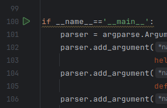
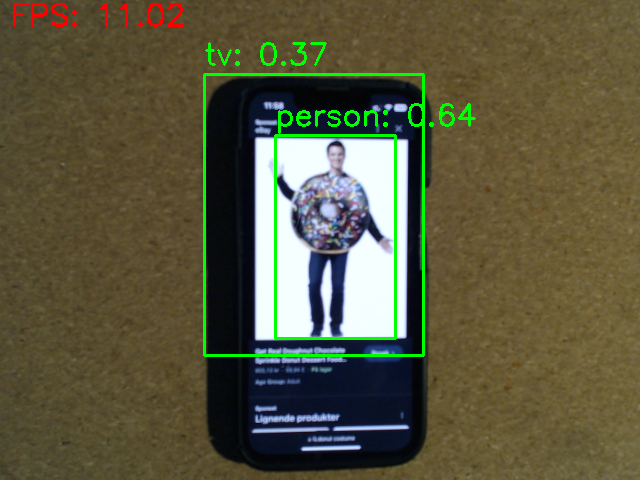
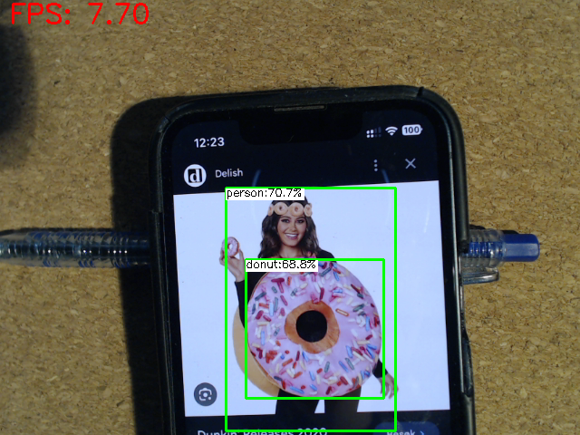
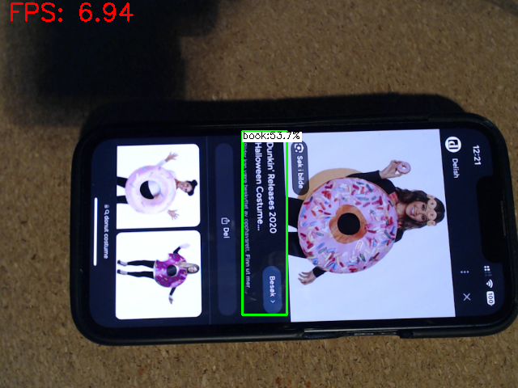

# Step 2: Play around with examples from the OpenCV model zoo

Browse the directory `opencv_zoo/models`.

Each model has a README-file with instructions for the program,
and a file called `demo.py` that you are supposed to run.
The easiest is to choose the applications that already takes input from the webcamera.

### Object detection
If you need a push to get started, let us try [object detection with nanodet](../opencv_zoo/models/object_detection_nanodet/README.md).

- In PyCharm, open the file `opencv_zoo/models/object_detection_nanodet/demo.py`
- Press the <!-- play --> &#9658; symbol on line 100 to start the application.

  

- If you have multiple cameras plugged into your computer, you might have to change the `deviceId` (camera index) on line 161.
- Point the camera at different objects around you. What kind of objects are detected?
  Can the detector be fooled?
- From line 20, you can see which classes this detector knows.

  As there aren't many airplanes and zebras in the lab, you can pull out your phone and find images of the different classes.

  

- Now, do the same with [object detection with yolox](../opencv_zoo/models/object_detection_yolox/README.md),

  open the `demo.py`, (change camera index) and press <!-- play --> &#9658;.
- How does it perform compared to the previous model?

  &nbsp;

### More demos
Continue to explore the models and run the examples. If you need suggestions, you can try

- [text recognition crnn](../opencv_zoo/models/text_recognition_crnn/README.md)
- [facial expression recognition](../opencv_zoo/models/facial_expression_recognition/README.md)
- ...

What can we do with the output from these models? 

After playing around for a bit, continue to the [next step](3-opencv-tutorials.md).
